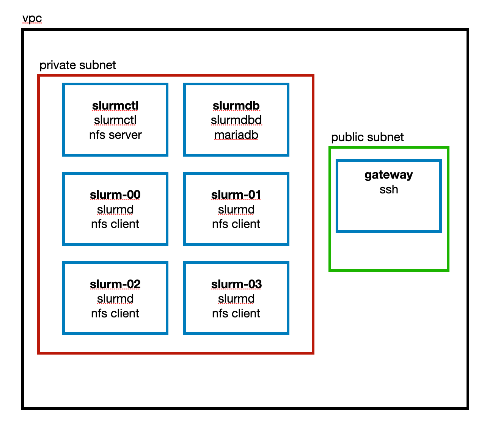

# Learning Slurm

Builds a [slurm cluster](https://slurm.schedmd.com/overview.html) in AWS for learning.

The built system looks like the following diagram. Each server is running Ubuntu 22.04 LTS.

This configuration is very basic at the moment - definitely just for learning, not production. 

It's a work in progress with more to come at some point:

* more sophisticated cluster configuration
* users with home directories on the nfs server
* adding support for slurmrestd
* some tools to use the rest API

And I'm sure there are a lot of things I don't know about yet that will get added as well.

## Prerequisites

You need an AWS account for this to work. If you can get the AWS CLI working, then you will
have everything in place that you need to get this to run.

Terraform is used to build the AWS infrastructure and also create the ansible scripts.

Ansible is used to configure the servers.

## Quickstart

The build and configuration is fully automated with the terraform and ansible files in the `build-aws`
directory.

First, within the `build-aws` directory, copy the `terraform.tfvars.example` file to `terraform.tfvars` and 
update the variables to:

* set the aws profile and region to use
* set a custom internal domain
* set the number of workers to create

Build the infrastructure and ansible configurations with terraform:

    terraform init
    terraform apply

This create a directory called `local` and in there you can see the ansible configs as well as an
ssh configuration file so you can log into all the machines that have been created. For example,
to log into the slurm controller:

    ssh -F local/ssh.cfg slurmctl

Before moving on to the next step, wait for the servers to be fully up and running. If you can log
into them and see that their hostname is different from the default AWS naming, then everything is
ready.

Configure the machines:

    ./local/ansible/run-ansible.sh

At this point you should be able to do some basic testing as in the next section.

To shut it all down, run:

    terraform destroy

## Testing

You should be able to follow along 
with this [tutorial video](https://youtu.be/U42qlYkzP9k) that's referenced from the SchedMD website.
The instructions below are basically the same as in the video.

Log into the controller:

    ssh -F local/ssh.cfg slurmctl

Get some information about the cluster:

    sinfo

    PARTITION AVAIL  TIMELIMIT  NODES  STATE NODELIST
    studio*      up   infinite      2   idle slurm-[00-01]

Take a look at the details for one of the nodes:

    scontrol show node slurm-00

    NodeName=slurm-00 Arch=x86_64 CoresPerSocket=1 
       CPUAlloc=0 CPUTot=1 CPULoad=0.06
       AvailableFeatures=(null)
       ActiveFeatures=(null)
       Gres=(null)
       NodeAddr=slurm-00 NodeHostName=slurm-00 Version=21.08.5
       OS=Linux 5.19.0-1024-aws #25~22.04.1-Ubuntu SMP Tue Apr 18 23:41:58 UTC 2023 
       RealMemory=1 AllocMem=0 FreeMem=201 Sockets=1 Boards=1
       State=IDLE ThreadsPerCore=1 TmpDisk=0 Weight=1 Owner=N/A MCS_label=N/A
       Partitions=studio 
       BootTime=2023-05-10T21:33:59 SlurmdStartTime=2023-05-10T22:11:46
       LastBusyTime=2023-05-10T22:16:35
       CfgTRES=cpu=1,mem=1M,billing=1
       AllocTRES=
       CapWatts=n/a
       CurrentWatts=0 AveWatts=0
       ExtSensorsJoules=n/s ExtSensorsWatts=0 ExtSensorsTemp=n/s

Create a simple test script called hello-slurm.sh:

    #!/usr/bin/env bash
    echo hello $HOSTNAME
    sleep 10
    exit $?

Submit the job:

    sbatch -N1 -n1 hello-slurm.sh

    Submitted batch job 1

Check the status using the job id returned:

    scontrol show job 1

    JobId=1 JobName=hello-slurm.sh
       UserId=ubuntu(1000) GroupId=ubuntu(1000) MCS_label=N/A
       Priority=4294901759 Nice=0 Account=(null) QOS=normal
       JobState=RUNNING Reason=None Dependency=(null)
       Requeue=1 Restarts=0 BatchFlag=1 Reboot=0 ExitCode=0:0
       RunTime=00:00:06 TimeLimit=UNLIMITED TimeMin=N/A
       SubmitTime=2023-05-10T22:16:25 EligibleTime=2023-05-10T22:16:25
       AccrueTime=2023-05-10T22:16:25
       StartTime=2023-05-10T22:16:25 EndTime=Unknown Deadline=N/A
       SuspendTime=None SecsPreSuspend=0 LastSchedEval=2023-05-10T22:16:25 Scheduler=Main
       Partition=studio AllocNode:Sid=slurmctl:4722
       ReqNodeList=(null) ExcNodeList=(null)
       NodeList=slurm-00
       BatchHost=slurm-00
       NumNodes=1 NumCPUs=1 NumTasks=1 CPUs/Task=1 ReqB:S:C:T=0:0:*:*
       TRES=cpu=1,node=1,billing=1
       Socks/Node=* NtasksPerN:B:S:C=0:0:*:* CoreSpec=*
       MinCPUsNode=1 MinMemoryNode=0 MinTmpDiskNode=0
       Features=(null) DelayBoot=00:00:00
       OverSubscribe=NO Contiguous=0 Licenses=(null) Network=(null)
       Command=/home/ubuntu/hello-slurm.sh
       WorkDir=/home/ubuntu
       StdErr=/home/ubuntu/slurm-1.out
       StdIn=/dev/null
       StdOut=/home/ubuntu/slurm-1.out
       Power=

Submit a bunch of jobs in held state so they don't disappear too quickly:

    sbatch -H -N1 -n1 hello-slurm.sh
    sbatch -H -N1 -n1 hello-slurm.sh
    sbatch -H -N1 -n1 hello-slurm.sh

Check the status of them all:

    squeue

    JOBID PARTITION     NAME     USER ST       TIME  NODES NODELIST(REASON)
        4    studio hello-sl   ubuntu PD       0:00      1 (JobHeldUser)
        3    studio hello-sl   ubuntu PD       0:00      1 (JobHeldUser)
        2    studio hello-sl   ubuntu PD       0:00      1 (JobHeldUser)

And cancel them:

    scancel 2
    squeue

    JOBID PARTITION     NAME     USER ST       TIME  NODES NODELIST(REASON)
        4    studio hello-sl   ubuntu PD       0:00      1 (JobHeldUser)
        3    studio hello-sl   ubuntu PD       0:00      1 (JobHeldUser)

    scancel 3 4
    squeue

    JOBID PARTITION     NAME     USER ST       TIME  NODES NODELIST(REASON)

